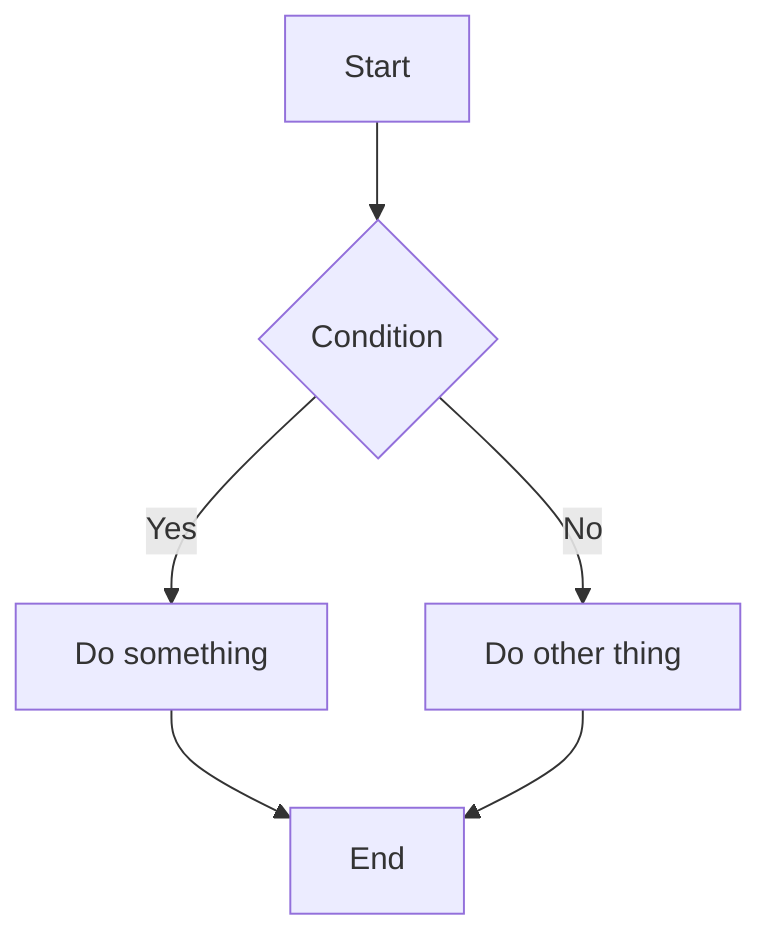
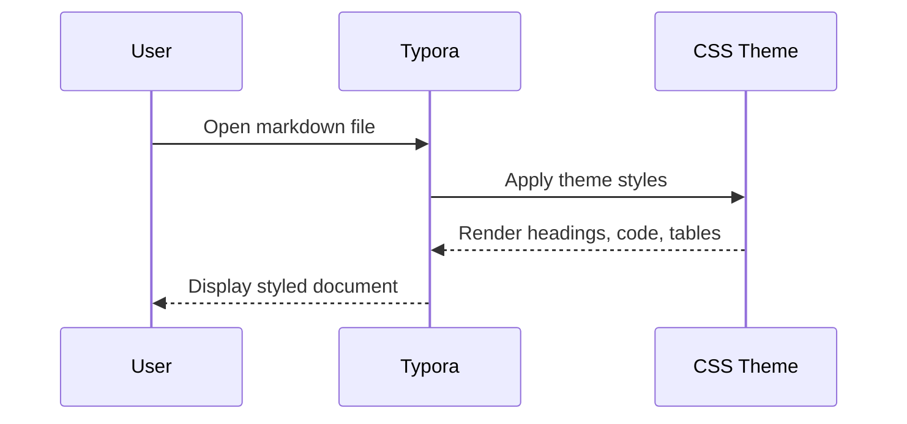
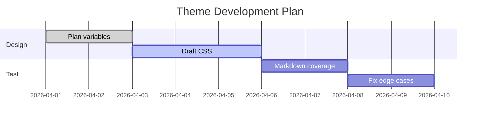

# Typora Markdown Theme Full Test

> 用途：尽可能测试 Typora 主题对各种 Markdown / HTML / 数学 / 图表 / 脚注 / 参考文献样式的覆盖情况。

---

## 目录测试

[TOC]

---

# 1. 标题测试

# H1 一级标题
## H2 二级标题
### H3 三级标题
#### H4 四级标题
##### H5 五级标题
###### H6 六级标题

一级标题下的普通段落。用于测试正文、行高、段距、首尾间距、中文字体、英文混排、数字混排效果。

这是第二段。This is a paragraph with English words, numbers 1234567890, and symbols `+-*/=<>~`.

---

# 2. 强调与行内语义测试

普通文本

*斜体文本*  
_斜体文本（下划线语法）_

**粗体文本**  
__粗体文本（下划线语法）__

***粗斜体文本***  
___粗斜体文本（下划线语法）___

~~删除线文本~~

==高亮文本==

`行内代码 inline code`

上标：x^2^  
下标：H~2~O

组合测试：这是 **粗体里带 `code`** 的句子。  
组合测试：这是 *斜体里带 [链接](https://example.com)* 的句子。  
组合测试：这是 ~~删除线里带 `code`~~ 的句子。

---

# 3. 分割线测试

---

***

___

---

# 4. 引用块测试

> 这是一级引用。
>
> 这是引用中的第二段，用于测试段落间距。

> 这是引用中的列表：
> - 项目 A
> - 项目 B
>   - 子项目 B1
>   - 子项目 B2

> ### 引用中的标题
>
> 引用中的正文，包含 **粗体**、*斜体*、`code` 和 [链接](https://example.com)。

> > 这是二级嵌套引用。
> >
> > 二级引用中的第二段。

> > > 这是三级嵌套引用。

---

# 5. 列表测试

## 5.1 无序列表

- 一级项目 A
- 一级项目 B
- 一级项目 C
  - 二级项目 C-1
  - 二级项目 C-2
    - 三级项目 C-2-a
    - 三级项目 C-2-b

* 星号列表项 1
* 星号列表项 2

+ 加号列表项 1
+ 加号列表项 2

## 5.2 有序列表

1. 第一项
2. 第二项
3. 第三项
   1. 第三项的子项 1
   2. 第三项的子项 2

## 5.3 任务列表

- [ ] 未完成任务
- [x] 已完成任务
- [ ] 包含 **粗体** 的任务
- [x] 包含 `code` 的任务
  - [ ] 嵌套未完成任务
  - [x] 嵌套已完成任务

---

# 6. 链接测试

这是一个普通链接：[OpenAI](https://openai.com)

这是一个自动链接：<https://example.com>

这是一个邮箱链接：<test@example.com>

这是一个带标题的链接：[Example](https://example.com "链接标题")

这是一个参考式链接：[参考链接1][ref-link-1]

[ref-link-1]: https://example.com "参考式链接标题"

---

# 7. 图片与图注测试


普通图片上方一段文字。

<figure>
  
  <figcaption>Figure 1. 使用 HTML figure + figcaption 的图注测试。</figcaption>
</figure>
内联图片测试：这里有一个小图标  
  
用于观察行内对齐。

---

# 8. 代码测试

## 8.1 行内代码

这是 `inline code`，这是 ``code with `backtick` inside``。

## 8.2 代码块：无语言

``` 
Plain code block
line 2
line 3
```

## 8.3 代码块：Python

```python
def greet(name: str) -> str:
    return f"Hello, {name}"

print(greet("Typora"))
```

## 8.4 代码块：JavaScript

```javascript
function sum(a, b) {
  return a + b;
}
console.log(sum(2, 3));
```

## 8.5 代码块：CSS

```css
:root {
  --bg: #ffffff;
  --fg: #222222;
  --accent: #3a6df0;
}

#write {
  max-width: 900px;
  line-height: 1.75;
}
```

## 8.6 代码块：JSON

```json
{
  "name": "Typora Theme Test",
  "version": "1.0.0",
  "features": ["math", "table", "footnote", "mermaid"]
}
```

## 8.7 代码块：Bash

```bash
echo "Hello, world"
ls -la
pwd
```

## 8.8 代码块：HTML

```html
<div class="card">
  <h3>Card Title</h3>
  <p>Card content.</p>
</div>
```

---

# 9. 表格测试

## 9.1 基础表格

| 列 1 | 列 2    | 列 3 |
| ---- | ------- | ---- |
| A    | B       | C    |
| 1    | 2       | 3    |
| 中文 | English | 123  |

## 9.2 对齐表格

| 左对齐   | 居中对齐 | 右对齐 |
| :------- | :------: | -----: |
| apple    |  banana  |     12 |
| cat      |   dog    |    345 |
| 中文文本 | 居中文本 |   6789 |

## 9.3 表格中包含格式

| 元素     | 示例                           |
| -------- | ------------------------------ |
| 粗体     | **bold**                       |
| 斜体     | *italic*                       |
| 删除线   | ~~strike~~                     |
| 行内代码 | `code`                         |
| 链接     | [Example](https://example.com) |

---

# 10. 脚注测试

这是一个带脚注的句子。[^1]

这是第二个脚注示例，用于测试多个脚注。[^long-note]

脚注也可以放在一段较长文本后面，用来看上标、跳转、底部样式是否协调。[^cn]

[^1]: 这是一个简短脚注。
[^long-note]: 这是一个较长脚注。它包含更多内容，用于测试脚注区域的段距、字号、链接颜色与回链显示效果。
[^cn]: 这是中文脚注，用于观察中文脚注的排版和行高。

---

# 11. 数学公式测试

## 11.1 行内公式

欧拉公式 $e^{i\pi} + 1 = 0$。

质量作用定律可写作 $K = \frac{a_C^c a_D^d}{a_A^a a_B^b}$。

扩散控制电流与浓度近似满足 $i \propto nFAD\frac{C^*}{\delta}$。

## 11.2 块级公式

$$
E = mc^2
$$

$$
\frac{\partial c}{\partial t} = D \nabla^2 c
$$

$$
i = i_0 \left[
\exp\left(\frac{\alpha_a F \eta}{RT}\right)
-
\exp\left(-\frac{\alpha_c F \eta}{RT}\right)
\right]
$$

$$
Z_W = \sigma (1 - j)\omega^{-1/2}
$$

$$
\begin{aligned}
a^2 + b^2 &= c^2 \\
\int_0^\infty e^{-x}\,dx &= 1
\end{aligned}
$$

矩阵测试：

$$
A =
\begin{bmatrix}
1 & 2 & 3 \\
4 & 5 & 6 \\
7 & 8 & 9
\end{bmatrix}
$$

---

# 12. 参考文献测试

> 说明：Markdown 没有统一标准参考文献语法，这里给出几种常见展示方式，用于测试主题样式。

正文中引用文献示例：电极过程动力学常见处理可参考 Bard 与 Faulkner 的教材 [1]，而阻抗谱的线性系统处理也常见于相关专著 [2]。

也可以用脚注模拟引用。[^ref-bard]

## References

[1] Bard, A. J.; Faulkner, L. R. *Electrochemical Methods: Fundamentals and Applications*. 2nd ed.; Wiley: New York, 2001.

[2] Orazem, M. E.; Tribollet, B. *Electrochemical Impedance Spectroscopy*. 2nd ed.; Wiley, 2017.

[3] Newman, J.; Thomas-Alyea, K. E. *Electrochemical Systems*. 3rd ed.; Wiley-Interscience, 2004.

[^ref-bard]: Bard, A. J.; Faulkner, L. R. *Electrochemical Methods: Fundamentals and Applications*. 2nd ed.

---

# 13. Emoji / 图标 / 特殊字符测试

常见 Emoji：😀 😃 😄 😁 😅 😂 🤔 😴 🚀 ✅ ❌ ⚠️ 📌 📎 🧪 📚

箭头与符号：← → ↑ ↓ ⇌ ⇒ ⇐ ↔ ∴ ∵ ∑ ∏ √ ∞ ≈ ≠ ≤ ≥ ± × · °

货币与单位：$ € ¥ ℃ µm mA cm⁻² mol·L⁻¹

星号与项目符号：• ◦ ▪ ▫ ◆ ◇ ○ ●

## 13.1 HTML 内联 SVG 图标测试

<svg width="24" height="24" viewBox="0 0 24 24" style="vertical-align: middle;">
  <circle cx="12" cy="12" r="10" fill="#4f46e5"></circle>
  <text x="12" y="16" text-anchor="middle" font-size="10" fill="white">AI</text>
</svg>

上面这个 SVG 用于测试内联图标与文字的对齐。

---

# 14. HTML 扩展元素测试

## 14.1 <kbd>

按下 <kbd>Ctrl</kbd> + <kbd>S</kbd> 保存文件。  
按下 <kbd>Cmd</kbd> + <kbd>P</kbd> 打开命令面板。

## 14.2 <mark>

这是 <mark>HTML mark 高亮</mark> 测试。

## 14.3 <details>

<details>
  <summary>点击展开更多内容</summary>

  这里是折叠区域内的内容。

  - 列表项 1
  - 列表项 2

  还可以包含 **粗体**、`code` 和公式 $a+b=c$。
</details>

## 14.4 自定义 div

<div class="custom-block" style="padding: 12px; border: 1px solid #999; border-radius: 8px;">
  这是一个自定义 HTML 块，用于测试 div、边框、圆角、内边距和块级元素的默认渲染。
</div>

---

# 15. Mermaid 图表测试

## 15.1 流程图



## 15.2 时序图



## 15.3 甘特图



---

# 16. 混合排版测试

这是一个复杂段落，包含 **粗体**、*斜体*、~~删除线~~、`inline code`、[链接](https://example.com)、脚注[^mix]、行内公式 $Z = Z' + jZ''$，以及 Emoji 🧪。

> 这是一个引用块，里面还有一个表格：
>
> | 参数 | 数值   |
> | ---- | ------ |
> | Rct  | 12.3 Ω |
> | Cdl  | 45 µF  |
>
> 以及一个列表：
> - 项目一
> - 项目二
>
> 再加一个公式：
>
> $$
> j = j_0 \left(\exp\frac{\alpha F \eta}{RT} - \exp\frac{-(1-\alpha)F\eta}{RT}\right)
> $$

[^mix]: 这是混合排版段落对应的脚注。

---

# 17. 长段落与换行测试

这是一个较长段落，用于测试长文本阅读时的宽度、行长、行高、字间距与段落间距是否舒适。中文文本在不同主题下很容易出现过密、过松、标题拥挤、代码块抢眼、引用块边框过重、表格横线太显眼等问题，所以长段落测试非常重要。The quick brown fox jumps over the lazy dog. Pack my box with five dozen liquor jugs. 1234567890.

这是同一段后的下一段，用于观察段前段后间距。

这是一个  
手动换行测试，上一行末尾有两个空格。

这是另一种换行测试：  
使用 Markdown 显式换行。

---

# 18. HTML 注释测试

<!-- 这是一个 HTML 注释，正常渲染时不应显示 -->

注释上方和下方的段落间距也可以顺带观察。

---

# 19. 转义字符测试

\*这不是斜体\*  
\`这不是代码\`  
\[这不是链接\](https://example.com)

---

# 20. 最终综合测试区

## 小结

请检查以下内容是否协调：

- 标题层级是否清楚
- 正文是否适合长时间阅读
- 引用块是否过重
- 代码块是否太抢眼
- 表格是否过密
- 脚注区是否易读
- 数学公式与正文间距是否合适
- Mermaid 是否继承主题风格
- HTML 扩展元素是否样式失控
- Emoji / SVG / 图片 / figure 是否对齐正常

## 最后一段

如果一个 Typora 主题在这份文件里大多数区域都没有明显崩坏，那它基本就能用于日常写作和笔记了。
